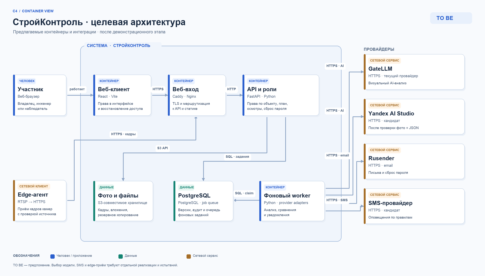

# Архитектура AS IS и TO BE

## AS IS — реализовано

На опубликованном стенде работают React/Vite, Caddy и Nginx, FastAPI, PostgreSQL, внешнее S3, GateLLM и Rusender. Сервис не требует SMS или облачного переключателя для текущего демо. Сохранённые ответы GateLLM являются частью фактического результата, а дневной статус считает сервер по правилам. Компоненты и таблицы описаны в [PROJECT_OVERVIEW.md](PROJECT_OVERVIEW.md) и [DATA_MODEL.md](DATA_MODEL.md).

## TO BE — предложения, пока не реализованы

| Приоритет | Изменение | Что нужно сделать и как проверить |
| --- | --- | --- |
| 1 | Роли по объекту | Ввести членство в объекте и серверную матрицу прав: владелец, инженер, наблюдатель, администратор. Проверить запрет чужих объектов на каждом API-методе, отдельно право осмотра и правки плана. |
| 1 | «Забыли пароль» | Добавить настоящий поток: одноразовый ограниченный по времени токен, хранить только его хэш, письмо через Rusender, ограничение частоты, отзыв старых сессий. Ссылку на форму входа показывать после готовности backend; один только UI-переход вводил бы в заблуждение. |
| 2 | Очередь задач и наблюдаемость | Вынести долгий анализ и сравнения в отдельный worker. Для первого этапа использовать таблицу заданий в PostgreSQL с атомарным захватом и повторами; при росте нагрузки оценить отдельную очередь. Явно показывать статус, собирать метрики времени, ошибок и стоимости. Настроить регулярный тест восстановления PostgreSQL и S3 из резервных копий. |
| 2 | Переключатель GateLLM / Yandex AI Studio | Ввести адаптер с одинаковым внутренним контрактом анализа и сравнения, настройку провайдера на уровне стенда или объекта, логирование версии модели и провайдера в каждой попытке. До включения проверить выбранную модель на реальных фото, мультимодальном запросе, строгом JSON, ссылках на кадры, таймаутах, цене и повторяемости. Наличие API не доказывает совместимость с текущим контрактом. |
| 3 | Уведомления | Ввести события (подтверждённое возможное отклонение, провал обработки, осмотр), предпочтения и правила частоты. Rusender — для email; отдельный SMS-провайдер — после подтверждения необходимости и номера. Не отправлять уведомление на основании одиночного слабого кадра. |
| 3 | Автоматический приём кадров | Edge-агент для камер с RTSP/ONVIF, проверка времени и источника, безопасная очередь загрузки. Существующая ручная загрузка сохраняется. |

Порядок 1–3 — предложения по развитию после хакатонной демонстрации; на работающем стенде эти функции пока отсутствуют.

Официальная документация [Yandex AI Studio](https://aistudio.yandex.ru/ru/docs/) описывает API и SDK; конкретный выбор модели и пригодность для данного визуального JSON-контракта требуют отдельного испытания. По API SDK доступен [список моделей и запуск chat completions](https://aistudio.yandex.ru/ru/docs/ai-studio/sdk-ref/sync/chat/completions).
