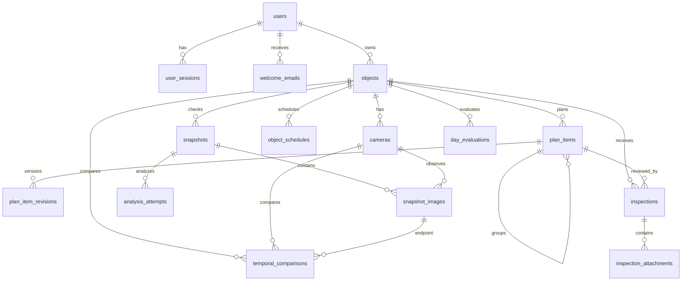

# СтройКонтроль — модель данных AS IS

Основание: фактические модели SQLAlchemy в `backend/app/models.py` и миграции `backend/alembic/versions/` на 28.09.2026. Это физическая модель PostgreSQL, а не только концептуальная схема ТЗ. Все основные первичные ключи — UUID в строковом представлении.

## Сущности и связи

| Таблица | Назначение и существенные поля |
| --- | --- |
| `users` | Учетная запись: уникальный `email`, `password_hash`, `is_demo`. |
| `user_sessions` | Сессия: `user_id`, уникальный хэш токена, срок действия. |
| `welcome_emails` | Попытки приветственного письма: получатель, статус, число попыток, идентификатор провайдера, ошибка. |
| `objects` | Стройобъект и владелец: тип, адрес, часовой пояс, черновик/архив, ключ демо-набора. |
| `cameras` | Камера объекта: уникальный в пределах объекта код, имя, зона, JSON-паспорт, ревизия поля зрения. |
| `plan_items` | Этап: даты, код, родитель для группировки, способ подтверждения, наблюдаемость, камеры, снимок профиля, версия. |
| `plan_item_revisions` | История правок этапа: версия, событие, JSON-снимок состояния. |
| `object_schedules` | Версии расписания: дата начала действия, список времён в JSON, пороги подтверждения и отсутствия. |
| `snapshots` | Проверка объекта на момент времени: статус, интервал, источник и снимок плана. Пара `(object_id, observed_at)` уникальна. |
| `snapshot_images` | Фото проверки: камера, ключ S3, хэш SHA-256, происхождение, имя и ревизия ракурса на момент съёмки. Пара `(snapshot_id, camera_id)` уникальна. |
| `analysis_attempts` | Каждая попытка AI: провайдер, модель, версия промпта, исходный и нормализованный JSON, ошибка, время, токены, стоимость, ключ идемпотентности. |
| `inspections` | Осмотр инженера: объект, этап, дата, срок действия, вердикт, автор, роль и комментарий. `role` здесь текстовая подпись автора, а не реализованная модель прав. |
| `inspection_attachments` | Файлы осмотра: S3-ключ, имя, тип, размер, хэш. |
| `day_evaluations` | Сохранённая оценка дня: дата, версия правил, снимки расписания и плана, JSON-результат. Пара `(object_id, evaluation_date)` уникальна. |
| `temporal_comparisons` | Сравнение двух фото одной камеры: ссылки на оба кадра, результат и сырой ответ модели, провайдер, время, ошибка. Пара кадров уникальна. |

Итого **15 таблиц**. Файлы находятся во внешнем S3; в PostgreSQL записаны ключи хранения и метаданные. Изменение паспорта камеры увеличивает `fov_revision`; сравнение кадров разных ревизий отклоняется.

## Производные данные и границы модели

- Дневные статусы сохраняются в `day_evaluations.result` вместе со снимками правил и входного контекста. Отдельной таблицы `stage_assessments` в физической схеме нет.
- Временные интервалы хранятся как `object_schedules.times` и `snapshots.control_slot`, а не в отдельной таблице `control_slots`.
- Сигнал «N дней без видимых перемещений» вычисляется из `temporal_comparisons` и связанных кадров; отдельной таблицы сигналов нет.
- Справочник этапов хранится в версионируемом JSON `config/stages/stage-directory.v2.json`, а не в БД.
- Связь этапа с камерами находится в `plan_items.camera_ids` (JSON-массив); это не отдельная таблица many-to-many.
- Ролевой модели, токенов восстановления пароля, SMS-событий и настроек выбора AI-провайдера сейчас нет. Они показаны только в TO BE.

## Целостность и доступ

Объект принадлежит пользователю через `objects.owner_id`; запросы API проверяют владение. Снимок, план, расписание, осмотр и оценка привязаны к объекту. Для точной интерпретации результата нужно сохранять используемые версии плана, расписания, промпта и модели. При повторной загрузке отпечатки файлов и ключ идемпотентности препятствуют двойному учёту. Секреты провайдеров и пароль БД хранятся в переменных окружения, не в таблицах и не в сдаваемом архиве.
