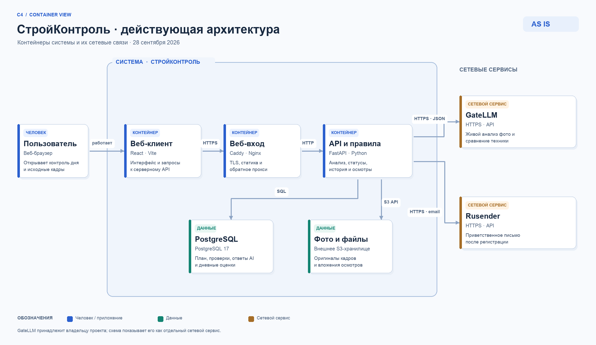

# СтройКонтроль — описание проекта

Актуально на 28.09.2026. Работающий стенд: https://pavelpetrov.tech.

## Назначение

Сервис принимает контрольные фотографии стройплощадки, сопоставляет увиденное с планом этапов, сохраняет исходные кадры и ответы модели и вычисляет объяснимую дневную оценку. Это рабочий хакатонный стенд. Он не делает инженерное заключение о выполнении работ: отсутствие видимых признаков на пригодных кадрах означает повод проверить площадку. Сигнал «техника без видимых перемещений» относится только к отдельным моментам наблюдения и не доказывает непрерывный простой.

## Что работает сейчас

- Регистрация, вход, сессия и изоляция объектов пользователей; демонстрационный вход `demo/demo`.
- Объекты, камеры и паспорта ракурсов; план с группировкой, версиями и способом подтверждения; расписание контрольных интервалов.
- Загрузка реальных файлов, хранение в S3, анализ фотографий через GateLLM, проверка схемы ответа и ссылок на кадры, сохранение каждой попытки.
- Детерминированный расчёт дневного статуса по пригодным проверкам и порогам. История, плёнка камеры, осмотры инженера, сравнение кадров и сигнал неподвижной техники.
- Приветственное письмо через Rusender после регистрации (доставка подтверждена владельцем сервиса). Вход не зависит от успешности отправки письма.
- Два заполненных демонстрационных объекта и черновик. Для объекта «Деловой центр Речной» в аккаунте `demo/demo` сохранены результаты живого анализа: на показательном дне три проверки, у этапа фундамента крана нет видимых признаков работ в трёх пригодных проверках, у гусеничного экскаватора нет видимых перемещений в серии за три дня. В интерфейсе есть явные карточки этих наблюдений и ссылки на кадры.

## Как получается результат

1. Пользователь выбирает объект, время проверки и загружает фотографии с привязкой к камерам.
2. Сервер сохраняет оригиналы и контекст плана на момент проверки.
3. GateLLM получает фотографии и контекст. Ответ должен соответствовать JSON-схеме; ошибки и повторы сохраняются, успешный результат не подменяется примером.
4. Правила дня оценивают повторные проверки, пригодность кадров, признаки этапов и осмотры. Подтверждение по камерам требует два положительных интервала; отсутствие признаков в трёх пригодных интервалах даёт статус «возможное отклонение».
5. Сравнения снимков одной камеры дают отдельный сигнал движения техники. Он не меняет статус этапа.

## Текущая архитектура

Браузерный React-клиент обслуживает Nginx, внешний HTTPS принимает Caddy, FastAPI реализует API и правила. PostgreSQL хранит пользователей, план, результаты и историю; внешнее S3 хранит файлы. GateLLM выполняет анализ, Rusender отправляет почту. Подробности физической схемы — в [DATA_MODEL.md](DATA_MODEL.md). Предложения по развитию — в [ARCHITECTURE_ROADMAP.md](ARCHITECTURE_ROADMAP.md).

## Сценарий показа

Войти как `demo/demo`, открыть два объекта и показать результаты уже сохранённых проверок. На объекте «Деловой центр Речной» открыть день с тремя контрольными интервалами, отсутствие видимых признаков работ по фундаменту крана и отдельный сигнал об отсутствии видимых перемещений экскаватора. Затем загрузить новые фотографии на тестовом объекте и показать результат живого анализа GateLLM вместе с исходными кадрами.

## Комплект и запуск

Репозиторий содержит приложение, контейнеры, миграции, конфигурационные шаблоны, примеры, этот обзор, модель данных и две схемы архитектуры. Секреты и рабочая база данных не публикуются. Команды локального запуска приведены в корневом `README.md`.
